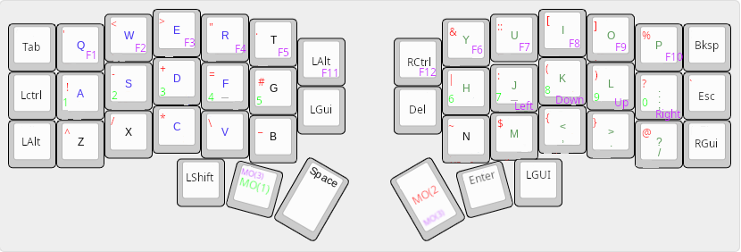
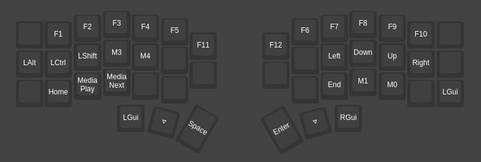

# keyboard-layout
My keyboard layout for the Corne V4 keyboard. \
The config is for the [vial](https://get.vial.today/) software.
## Overall layout

## Layer 0 (Base layer)

## Layer 1 (Number layer)

## Layer 2 (Symbol layer)
Heavily inspired by [this article](https://getreuer.info/posts/keyboards/symbol-layer/index.html) \

## Layer 3 (movement keys + function keys & other macro's)

